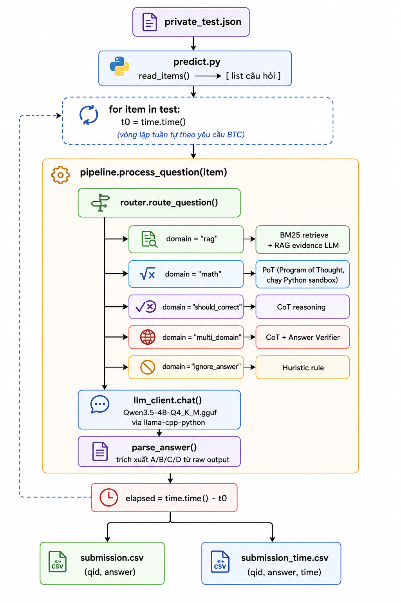

<h2 align="center">VIETNAMESE STUDENT HACKAITHON 2026 - Bảng C Innovator</h2>

**Đội thi — HM_Innovation**

1. Nguyễn Văn Hùng - **Trưởng nhóm**
2. Võ Lê Hoàng Minh - Thành viên

----

**Entry-point:** `predict.py` → đọc `/code/private_test.json` → sinh `submission.csv` + `submission_time.csv` vào `/code/`.

## Docker Hub

Image nộp lên Docker Hub: https://hub.docker.com/r/hoangminhtit/hm_innovation_submission

---

## Table of Contents

- [Pipeline Flow](#pipeline-flow)
- [Data Processing](#data-processing)
- [Resource Initialization](#resource-initialization)
- [Reproduce](#reproduce)
- [Chạy local bằng `scripts/run.sh`](#cách-1-chạy-local-bằng-scriptsrunsh)
- [Chạy bằng Docker](#cách-2-chạy-bằng-docker)
- [Cấu Hình](#cấu-hình)
- [Cấu Trúc Repo](#cấu-trúc-repo)

---

## Pipeline Flow



---

## Data Processing

- **Input:** file JSON (`private_test.json`) với cấu trúc `[{"id": "test_0001", "question": "...", "choices": {"A": "...", ...}, "context": "..."}]`
- **Tiền xử lý:** `utils/preprocess.py` — chuẩn hoá Unicode, loại bỏ ký tự đặc biệt, tách câu hỏi và lựa chọn
- **BM25 Retrieval:** `utils/bm25.py` — tự implement (không dùng thư viện ngoài), tách câu, tính TF-IDF để lấy đoạn context liên quan nhất
- **Output:** `submission.csv` + `submission_time.csv`

---

## Resource Initialization

Model GGUF được **bake sẵn vào Docker image** khi build — BTC không cần mount hay tải thêm:

```dockerfile
COPY model/ /code/model/
# model/Qwen3.5-4B-Q4_K_M.gguf phải có trước khi docker build
```

Nếu cần tải model thủ công (trước khi build):

```bash
python download_model.py
```

---

## Reproduce

### Cách 1: Chạy local bằng `scripts/run.sh`

```bash
mkdir -p output data
# Đảm bảo private_test.json nằm ở data/private_test.json

# Chỉ định rõ input và output dir
bash scripts/run.sh llm data/public-test.json output/

# Private test
bash scripts/run.sh llm data/private_test.json output/
```

Output sinh ra tại:
```
output/submission.csv          # qid,answer
output/submission_time.csv     # qid,answer,time
```

### Cách 2: Chạy bằng Docker

Chạy bằng Bash/Linux/macOS:

```bash
mkdir -p output

docker run --rm --gpus all \
  -e OUTPUT_DIR=/code/output \
  -v "$(pwd)/public_test.json:/code/public_test.json:ro" \
  -v "$(pwd)/output:/code/output" \
  hoangminhtit/hm_innovation_submission:latest
```

Chạy bằng Git Bash trên Windows:

```bash
mkdir -p output

MSYS_NO_PATHCONV=1 docker run --rm --gpus all \
  -e OUTPUT_DIR=/code/output \
  -v "$(pwd)/public_test.json:/code/public_test.json:ro" \
  -v "$(pwd)/output:/code/output" \
  hoangminhtit/hm_innovation_submission:latest
```

Chạy bằng PowerShell trên Windows:

```powershell
New-Item -ItemType Directory -Force output | Out-Null

docker run --rm --gpus all `
  -e OUTPUT_DIR=/code/output `
  -v "${PWD}/public_test.json:/code/public_test.json:ro" `
  -v "${PWD}/output:/code/output" `
  hoangminhtit/hm_innovation_submission:latest
```

Khi chạy private test, đổi `public_test.json` thành `private_test.json`.

Kiểm tra output:

```bash
head output/submission.csv
head output/submission_time.csv
```

Output kỳ vọng:

```csv
# submission.csv
qid,answer
test_0001,A
test_0002,C

# submission_time.csv
qid,answer,time
test_0001,A,1.2345
test_0002,C,0.9871
```

---

## Cấu Hình

Các biến môi trường chính (xem [.env.example](.env.example))

---

## Cấu Trúc Repo

```text
Dockerfile                    ← base nvidia/cuda:12.2.0-devel-ubuntu22.04
inference.sh                  ← CMD entry-point BTC (gọi predict.py)
predict.py                    ← main entry-point: đọc JSON, chạy pipeline, ghi 2 CSV
pipeline.py                   ← orchestrator pipeline
router.py                     ← phân loại domain câu hỏi
prompts.py                    ← prompt templates
domains/                      ← domain-specific logic (rag, math, multi_domain, ...)
utils/
  llm.py                      ← LLMClient (llama-cpp-python wrapper)
  bm25.py                     ← BM25 retrieval tự implement
  reasoning.py                ← PoT / CoT / RAG evidence / Answer Verifier
  input_loader.py             ← đọc JSON/CSV
  postprocess.py              ← parse A/B/C/D từ raw output
few-shot.json                 ← few-shot examples
download_model.py             ← tải GGUF từ HuggingFace
.env.example                  ← template cấu hình
requirements.txt              ← huggingface_hub, sentencepiece, sympy
scripts/run.sh                ← helper script chạy local
```
